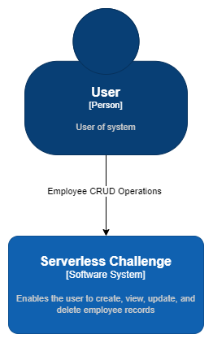
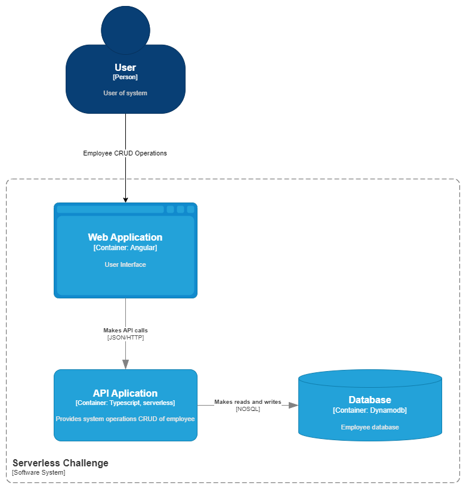
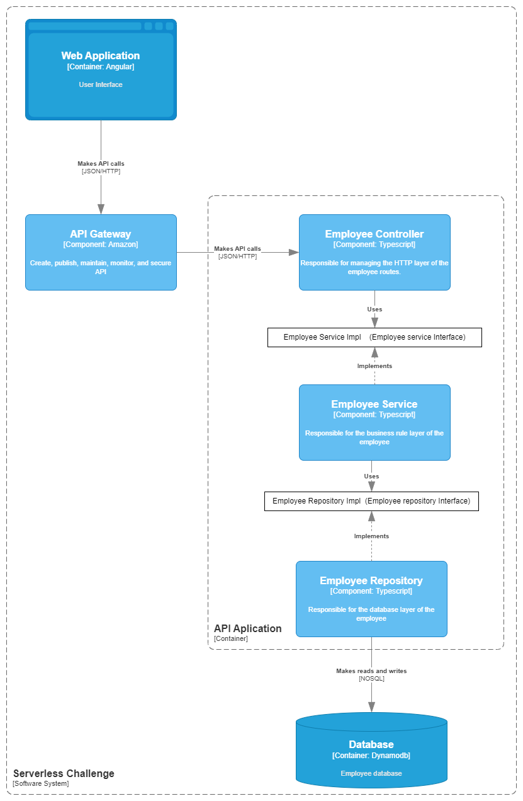
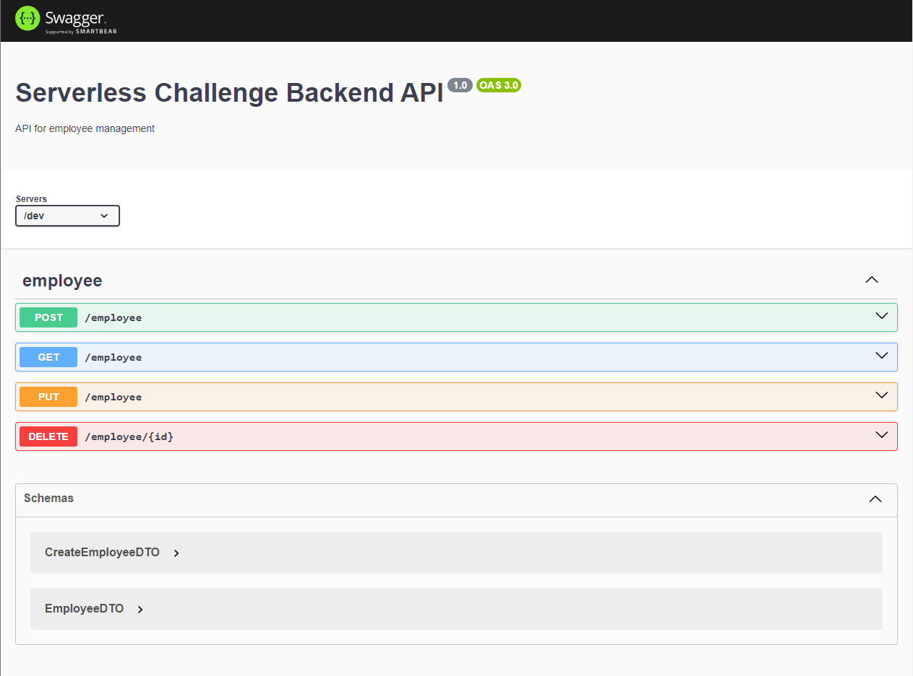

# Summary

[Description](#description) | [Installation](#installation) | [Git Steps](#git-steps) | [Installation](#installation) | [Test](#test) | [System overview](#system-overview) | [Swagger](#swagger)
## Description

 It is a system where you can manage registered employees (create, view, update, and delete). It is being utilized with [serverless](https://www.serverless.com/) (AWS Lambda), [NestJS](https://github.com/nestjs/nest)  framework, and a NoSQL database [DynamoDB](https://aws.amazon.com/dynamodb/)

## Installation

```bash
$ aws configure
```

```bash
$ npm install
```

## Git Steps

```bash
$ git add (. or file)
```

The system uses git hooks (husky, [conventional commits](https://www.conventionalcommits.org/en/v1.0.0/)) for commit standardization, so please use the following command

```bash
$ npm run commit
```

Choose one of these options and proceed to the end of the process: 


## Running the app

```bash
## build first

$ npm run build

## local

serverless offline 

## aws

serverless deploy

```

## Test

```bash
# unit tests
$ npm run test

# test coverage
$ npm run test:cov
```

## System overview 

The following images follow the C4 model, where each level delves deeper into the architecture of the project.

### Context


### Container


### Component



### Swagger

endpoint - this is for dev env

```bash
$ http://localhost:3000/dev/api#/employee
```



In this swagger, we can see the endpoints, test them, and view the schemas of the objects.